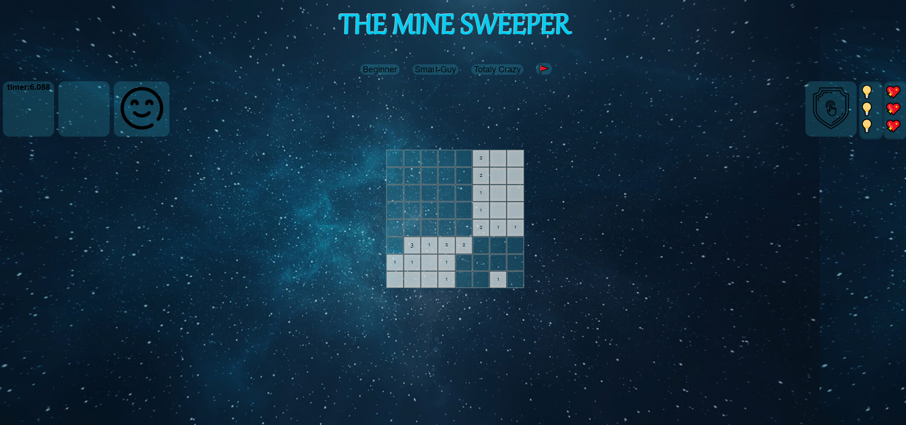
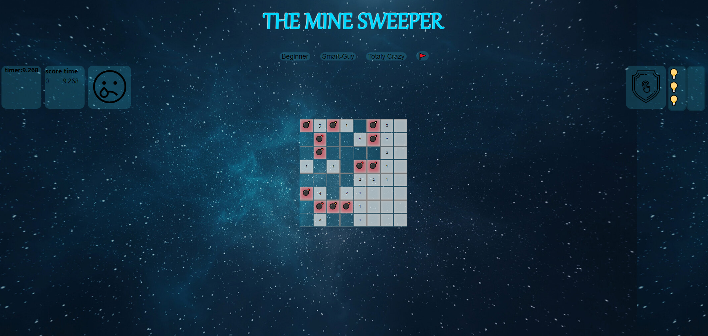

# -

<!-- Improved compatibility of back to top link: See: https://github.com/othneildrew/Best-README-Template/pull/73 -->

<!--
*** Thanks for checking out the Best-README-Template. If you have a suggestion
*** that would make this better, please fork the repo and create a pull request
*** or simply open an issue with the tag "enhancement".
*** Don't forget to give the project a star!
*** Thanks again! Now go create something AMAZING! :D
-->

<!-- PROJECT SHIELDS -->
<!--
*** I'm using markdown "reference style" links for readability.
*** Reference links are enclosed in brackets [ ] instead of parentheses ( ).
*** See the bottom of this document for the declaration of the reference variables
*** for contributors-url, forks-url, etc. This is an optional, concise syntax you may use.
*** https://www.markdownguide.org/basic-syntax/#reference-style-links
-->

 

  <h3 align="center">Minesweeper-game </h3>

  

<!-- ABOUT THE PROJECT -->
## About The Project

An app I wrote with Vanuila JavaScript, in which you can add play in the popular game "Minesweeper" .  [ Take a look, it's on Heroku !](https://eldadyikne.github.io/-Minesweeper-game/)

## 3 game level  
 
 

## You must win! or you get Game-over
 

 

## Technologies

- JavaScript
- Css 

